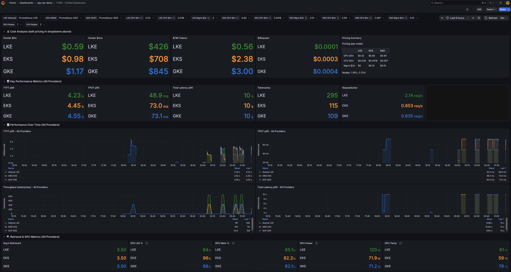
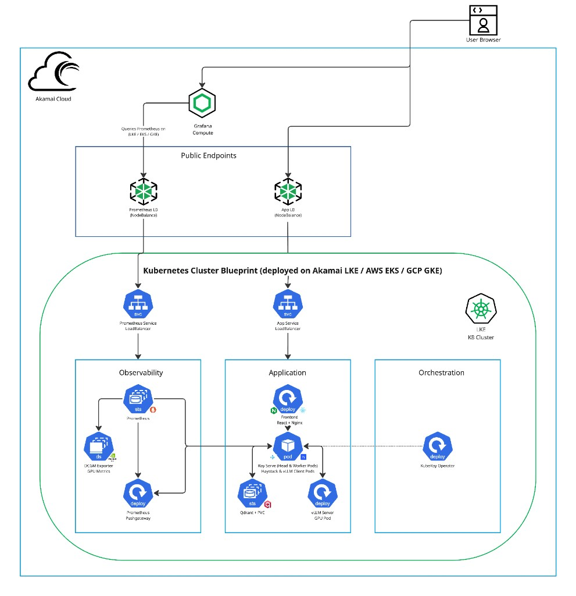

# Cloud-Portable RAG: Performance & Cost Scorecard

Cloud-portable RAG service using **Haystack + Ray Serve (KubeRay)** with **vLLM streaming inference**, deployable to:
- **Akamai LKE**
- **AWS EKS**
- **GCP GKE**

This repository is designed to answer a practical IT decision question:

> **For the same RAG workload, what performance do we get and what does it cost — across Kubernetes providers?**

---

## What you get

### 1) A portable RAG service (same app, multiple clouds)
- One service architecture and deployment surface across Akamai LKE / AWS EKS / GCP GKE.
- Pluggable model + vector store with minimal infra changes.

### 2) A measurement contract for streaming inference (SSE)
Server-Sent Events (SSE) event types: `meta`, `token`, `done`, `error`.

The `done` event is designed to support consistent measurement and correlation:
- `session_id`, `request_id`, `replica_id`, `model_id`, `k`, `documents`
- `timings` (`ttft_ms`, `total_ms`) for diagnostics/correlation
- `token_count`, `tokens_per_sec`

Metric definitions:
- **TTFT in the UI is client-measured** (send → first token) and is the source of truth.
- **Total latency in the UI is client-measured** (send → done/error) and is the source of truth.
- `done.timings.*` are server-side measurements used for diagnostics/correlation.
- Tokens/sec uses `done.tokens_per_sec` if present; else `token_count / stream_duration`.
- Token count uses `done.token_count` if present; else best-effort (# token events).
- `replica_id` uses the backend pod hostname for debugging.

### 3) A scorecard view (Grafana)
A Grafana dashboard intended to summarize:
- Latency (TTFT, total)
- Throughput (tokens/sec, requests/sec)
- Resource usage (GPU/CPU/memory)
- Error rate
- Cost model inputs and derived cost efficiency

→ See [docs/COST_MODEL.md](docs/COST_MODEL.md) for detailed cost analysis across providers.

---

## Benchmark Results — Median of 7 Runs (February 22, 2026)

7 runs × 500 requests = **3,500 requests per provider**. Backend 0.3.10, all providers single-zone Central US corridor, identical images.

🏆 = best value in row

### North-South Median

| Metric | Akamai LKE | AWS EKS | GCP GKE |
|--------|------------|---------|---------|
| **Success (total)** | 3,498/3,500 ✅ | 3,475/3,500 ⚠️ | 3,495/3,500 ✅ |
| **TTFT p50** | 4,556 ms | **1,518 ms** 🏆 | 2,325 ms |
| **TTFT p95** | 9,410 ms | 6,989 ms | **6,391 ms** 🏆 |
| **Latency p50** | **14,245 ms** 🏆 | 15,023 ms | 15,968 ms |
| **Latency p95** | 22,201 ms | **19,983 ms** 🏆 | 20,119 ms |
| **TPOT p50** | **37.9 ms** 🏆 | 54.2 ms | 56.6 ms |
| **TPOT p95** | **45.3 ms** 🏆 | 58.3 ms | 60.8 ms |
| **Tokens/sec** | **17.70** 🏆 | 16.22 | 15.30 |
| **Duration** | **155s** 🏆 | 172s | 181s |

### East-West Network Median

| Metric | Akamai LKE | AWS EKS | GCP GKE |
|--------|------------|---------|---------|
| **TCP Throughput** | 0.93 Gbps | **4.87 Gbps** 🏆 | 3.96 Gbps |
| **Retransmits** | 3,663 | 3,234 | **0** 🏆 |

### Cost Comparison

| Provider | Monthly (w/ network) | Hourly | Cost vs LKE |
|----------|---------------------|--------|-------------|
| **Akamai LKE** | **$433** 🏆 | **$0.59** | — |
| **AWS EKS** | $768 | $1.05 | +77% |
| **GCP GKE** | $807 | $1.11 | +86% |

See [docs/BENCHMARK_RESULTS.md](docs/BENCHMARK_RESULTS.md) for individual runs and historical results.

---

## Dashboard

*Live Grafana dashboard snapshot during a single benchmark run.*



---

## Architecture



### High-level components
- **Frontend (UI)** — Collects user prompts, streams tokens, and records client-side TTFT/total latency.
- **Backend (RAG API)** — Orchestrates retrieval + generation and emits SSE events (`meta`, `token`, `done`, `error`) and exposes `/metrics`.
- **Ray Serve on Kubernetes (KubeRay)** — Runs the serving layer and scales inference workers across GPU nodes.
- **vLLM (GPU inference)** — Performs token streaming generation and returns tokens back through the backend streaming pipeline.
- **Vector store / Retriever (via Haystack)** — Handles document ingestion and retrieval during RAG.
- **Observability (Prometheus + Grafana + DCGM)** — Each cluster runs Prometheus + DCGM exporter for GPU metrics. Central Grafana on LKE queries all three for the unified ITDM dashboard.

### Data flow (request lifecycle)
1. User uploads docs (UI → backend ingestion)
2. User sends prompt (UI → backend request)
3. Backend executes:
   - Retrieve top-k passages (Haystack)
   - Construct prompt with context
   - Stream generation from vLLM via Ray Serve
4. Backend streams SSE:
   - `meta` (request/session context)
   - `token` (streaming tokens)
   - `done` (final metrics + correlation ids)
5. UI computes:
   - TTFT (send → first token)
   - Total latency (send → done/error)
6. Prometheus scrapes metrics; Grafana renders scorecard panels.

→ See [docs/ARCHITECTURE.md](docs/ARCHITECTURE.md) for detailed Mermaid diagrams.

---

## Repository layout (where to find things)

High-signal directories/files you will use when replicating deployments and benchmarks:

| Path | Description |
|------|-------------|
| `apps/backend/` | Backend service (RAG pipeline + streaming inference + metrics/logging) |
| `apps/frontend/` | UI for interactive RAG + streaming + client-side timing (TTFT/total) |
| `scripts/deploy.sh` | Primary deployment entrypoint for Kubernetes providers |
| `scripts/benchmark/` | Benchmark runners (North-South streaming tests) |
| `scripts/netprobe/` | East-West network benchmarks (iperf3-based) |
| `benchmarks/` | Benchmark results (JSON) by provider and type |
| `deploy/helm/rag-app/` | Helm chart for the application |
| `deploy/helm/dcgm-values.yaml` | DCGM exporter Helm values (EKS / non-GKE providers) |
| `deploy/monitoring/` | Prometheus, Pushgateway, and DCGM bridge manifests |
| `deploy/overlays/` | Kustomize overlays for provider-specific configuration |
| `grafana/dashboards/` | Grafana dashboard JSON exports (ITDM, GPU, cost, vLLM) |
| `docs/DEPLOYMENT.md` | Step-by-step deployment guide for all providers |
| `docs/BENCHMARK_RESULTS.md` | Historical benchmark results across all providers |
| `docs/ARCHITECTURE.md` | Detailed architecture diagrams |
| `docs/COST_MODEL.md` | Cost analysis across providers |
| `docs/PROJECT_STATE.public.md` | Project state / scope / progress notes |
| `docs/OPERATIONS.public.md` | Ops notes: environments, debugging, reliability guidance |

> **New to the repo?** Read `docs/PROJECT_STATE.public.md` first, then `docs/OPERATIONS.public.md`.

---

## Deployment templates and configuration

### A) Local quick start (developer workstation)

```bash
git clone https://github.com/jgdynamite10/rag-ray-haystack
cd rag-ray-haystack
```

```bash
# Backend
cd apps/backend
uv sync --python 3.11
uv run --python 3.11 serve run app.main:deployment
```

```bash
# Frontend (new terminal)
cd apps/frontend
npm install
npm run dev
```

### B) Kubernetes deployment

```bash
# Deploy to a provider (akamai-lke, aws-eks, gcp-gke)
./scripts/deploy.sh --provider akamai-lke --env dev
```

See [docs/DEPLOYMENT.md](docs/DEPLOYMENT.md) for detailed instructions.

---

## GPU instances by provider

All providers use comparable Ada Lovelace architecture GPUs:

| Provider | Instance | GPU | Architecture | vRAM | GPU $/hr |
|----------|----------|-----|--------------|------|----------|
| Akamai LKE | g2-gpu-rtx4000a1-s | RTX 4000 Ada | Ada Lovelace | 20 GB | $0.52/hr |
| AWS EKS | g6.xlarge | NVIDIA L4 | Ada Lovelace | 24 GB | $0.8048/hr |
| GCP GKE | g2-standard-8 | NVIDIA L4 | Ada Lovelace | 24 GB | $0.85/hr |

→ See [docs/COST_MODEL.md](docs/COST_MODEL.md) for full cost breakdown including CPU, storage, and networking.

---

## Model configuration

Set `VLLM_MODEL` (backend env) or `vllm.model` in Helm values:

| Model | Use case |
|-------|----------|
| `Qwen/Qwen2.5-3B-Instruct` | Smaller/faster |
| `Qwen/Qwen2.5-7B-Instruct` | Default balanced |
| `Qwen/Qwen2.5-14B-Instruct` | Higher quality (more VRAM) |

Quantization can be enabled via Helm `vllm.quantization`.

---

## Why this stack

- **Cloud-portable**: One Helm chart + overlays for Akamai LKE, AWS EKS, and GCP GKE.
- **Production-grade serving**: KubeRay + Ray Serve + vLLM for scalable, streaming GPU inference.
- **Observable by default**: `/metrics`, structured logs, and portable benchmarking scripts.
- **Swap-friendly**: Pluggable models and vector store with minimal infra changes.
- **Ops-ready**: Build/push/deploy/verify/benchmark scripts baked in.

---

## License

MIT
