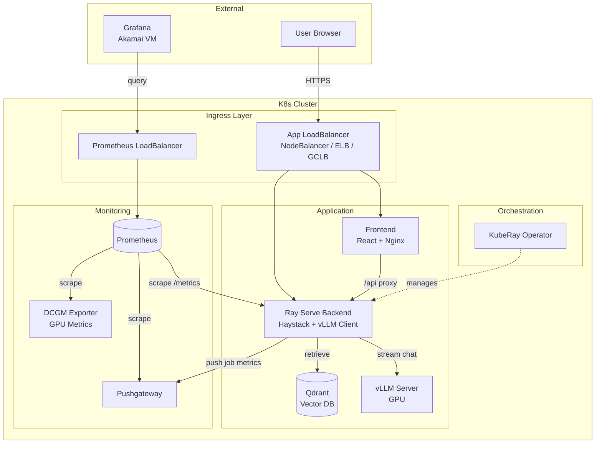

# Architecture

## Overview

- Frontend: React (Vite) chat UI with SSE streaming and metrics snapshot.
- Backend: Ray Serve deployment using Haystack for retrieval and vLLM for generation.
- Vector store: Qdrant for persistence (helm-deployed, OSS).
- LLM serving: vLLM OpenAI-compatible server for streaming tokens.
- Orchestration: KubeRay (RayService) running the backend workload.
- Packaging: Helm chart + Kustomize overlays for provider-specific diffs.

## Data flow

1. User uploads PDFs/text/URLs to `/ingest`.
2. Backend extracts text, chunks, embeds, and writes documents to the store.
3. User queries `/query` or `/query/stream`.
4. Backend retrieves top documents and calls vLLM for streaming generation.
5. SSE returns `meta`, `token`, `done`, `error` events to the UI.

## Component Details

### Embedding Model

| Property | Value |
|----------|-------|
| **Purpose** | Convert text (queries and documents) into vectors for similarity search |
| **Default model** | `sentence-transformers/all-MiniLM-L6-v2` |
| **Runs on** | CPU |
| **Env var** | `EMBEDDING_MODEL_ID` |

**How it works:**
1. During **ingest**: Documents are chunked and each chunk is embedded into a 384-dimensional vector, stored in Qdrant.
2. During **query**: User query is embedded using the same model, then used to find similar document vectors.

**Performance impact:**
- Larger embedding models (e.g., `all-mpnet-base-v2`) produce better retrieval but increase TTFT
- Embedding happens before retrieval, so it adds to first-token latency
- CPU-bound: faster CPUs = faster embedding

### Qdrant (Vector Database)

| Property | Value |
|----------|-------|
| **Purpose** | Store and retrieve document embeddings via similarity search |
| **Default collection** | `rag-documents` |
| **Env var** | `QDRANT_URL`, `QDRANT_COLLECTION` |

**How it works:**
1. Stores document chunks as vectors with metadata (text, source, etc.)
2. On query, performs approximate nearest neighbor (ANN) search
3. Returns top-k most similar documents (default k=5)

**Performance impact:**
- Index size affects retrieval speed
- More documents = slightly slower retrieval
- Runs on CPU, benefits from memory

### vLLM (LLM Inference Server)

| Property | Value |
|----------|-------|
| **Purpose** | Generate text responses using GPU-accelerated inference |
| **Default model** | `Qwen/Qwen2.5-7B-Instruct` (configurable) |
| **Runs on** | GPU (required) |
| **Env vars** | `VLLM_BASE_URL`, `VLLM_MODEL`, `VLLM_MAX_TOKENS`, etc. |

**How it works:**
1. Receives prompt (system + context + user query)
2. Performs prefill (processes all input tokens) - contributes to TTFT
3. Generates tokens one-by-one (autoregressive) - determines TPOT
4. Streams tokens back via OpenAI-compatible API

**Performance impact:**
- **Model size**: Larger models = slower but potentially better quality
- **GPU**: Directly determines generation speed (TPOT)
- **dtype**: `float16` vs `bfloat16` vs `int8` affects speed/quality
- **Quantization**: AWQ/GPTQ can speed up inference with some quality loss
- **KV cache**: Manages memory for context; larger contexts need more memory

### Request Flow with Timing

```
┌─────────────────────────────────────────────────────────────────────────┐
│                           QUERY REQUEST FLOW                            │
└─────────────────────────────────────────────────────────────────────────┘

User sends query
      │
      ▼
┌─────────────────┐
│ 1. EMBEDDING    │  ~10-50ms (CPU)
│    Query → Vec  │  - sentence-transformers model
└────────┬────────┘  - Env: EMBEDDING_MODEL_ID
         │
         ▼
┌─────────────────┐
│ 2. RETRIEVAL    │  ~5-20ms (depends on index size)
│    Vec → Docs   │  - Qdrant ANN search
└────────┬────────┘  - Returns top-k documents
         │
         ▼
┌─────────────────┐
│ 3. PROMPT BUILD │  <1ms
│    Docs → Prompt│  - Format context + query
└────────┬────────┘
         │
         ▼
┌─────────────────┐
│ 4. vLLM PREFILL │  ~50-200ms (GPU)
│    Prompt → KV  │  - Process all input tokens        ─┐
└────────┬────────┘  - Load into KV cache               │
         │                                               ├─ TTFT
         ▼                                               │
┌─────────────────┐                                     │
│ 5. FIRST TOKEN  │  ◄──────────────────────────────────┘
│    Generate[0]  │
└────────┬────────┘
         │
         ▼
┌─────────────────┐
│ 6. GENERATION   │  ~20-30ms per token (GPU)
│    Token by     │  - Autoregressive decoding          ─── TPOT
│    token        │  - Streams back to client
└────────┬────────┘
         │
         ▼
      Response complete
```

## Benchmark Dependencies

Changing any component affects benchmark results:

| Component | Metrics Affected | If Changed... |
|-----------|-----------------|---------------|
| Embedding model | TTFT | Larger model = higher TTFT |
| Qdrant | TTFT | More docs = slightly higher TTFT |
| vLLM model | TTFT, TPOT, tokens/sec | Different model = completely different results |
| GPU hardware | TPOT, tokens/sec | Faster GPU = lower TPOT |
| CPU hardware | TTFT | Faster CPU = faster embedding |
| dtype/quantization | TPOT | int8 faster than fp16 |

**For reproducible benchmarks, document:**
- Embedding model ID
- vLLM model ID + dtype + quantization
- GPU model (e.g., RTX 4090, L4, A100)
- Document count in Qdrant

## Architecture diagram



### Multi-Cluster Monitoring

```
┌─────────────────────────────────────────────────────────┐
│              Akamai VM (External)                       │
│                   Grafana                               │
│           (Unified dashboards)                          │
└─────────┬─────────────┬─────────────┬───────────────────┘
          │             │             │
          ▼             ▼             ▼
   ┌────────────┐ ┌────────────┐ ┌────────────┐
   │ LKE Prom LB│ │ EKS Prom LB│ │ GKE Prom LB│
   └──────┬─────┘ └──────┬─────┘ └──────┬─────┘
          ▼              ▼              ▼
   ┌────────────┐ ┌────────────┐ ┌────────────┐
   │  LKE       │ │  EKS       │ │  GKE       │
   │ Prometheus │ │ Prometheus │ │ Prometheus │
   │ Pushgateway│ │ Pushgateway│ │ Pushgateway│
   │ DCGM       │ │ DCGM       │ │ DCGM       │
   └────────────┘ └────────────┘ └────────────┘
```

## Observability

### Metrics Pipeline
- **Backend `/metrics`**: Prometheus-compatible counters and latency histograms (TTFT, TPOT, tokens/sec)
- **Backend `/stats`**: Lightweight UI-friendly snapshot of timings
- **Pushgateway**: Receives metrics from ephemeral benchmark jobs
- **DCGM Exporter**: GPU utilization, memory, temperature metrics
- **Prometheus**: Scrapes all metric endpoints within each cluster

### Visualization
- **Grafana** (self-hosted on Akamai VM): Centralized dashboards querying Prometheus in each cluster
- Unified view across LKE, EKS, and GKE deployments

### Logging
- Structured JSON logs via `python-json-logger`

## SSE event contract

- `meta`: `session_id`, `request_id`, `replica_id`, `model_id`, `k` (optional: `documents`)
- `token`: `{ "text": "<string>" }`
- `done`: `session_id`, `request_id`, `replica_id`, `model_id`, `k`, `documents`, `timings`
  (`ttft_ms`, `total_ms`), `token_count`, `tokens_per_sec`
- `error`: safe message + request/session identifiers

Streaming metrics:
- TTFT shown in UI is client-measured (send → first token event) and is the source of truth.
- Total latency shown in UI is client-measured (send → done/error) and is the source of truth.
- `done.timings.*` are server-side measurements for diagnostics and correlation.
- Tokens/sec uses `done.tokens_per_sec` if present; else `token_count / stream_duration`.
- Token count uses `done.token_count` if present; else best-effort (# token events).
- `replica_id` uses the backend pod hostname for debugging.

## Deployment

- Helm chart `deploy/helm/rag-app` installs backend, frontend, Qdrant, and RayService.
- Kustomize overlays in `deploy/overlays` customize storage class per provider.

## GPU instances by provider

All providers use comparable Ada Lovelace architecture GPUs:

| Provider | Instance | GPU | vRAM |
|----------|----------|-----|------|
| Akamai | g2-gpu-rtx4000a1-s | RTX 4000 Ada | 20 GB |
| AWS | g6.xlarge | NVIDIA L4 | 24 GB |
| GCP | g2-standard-8 | NVIDIA L4 | 24 GB |
