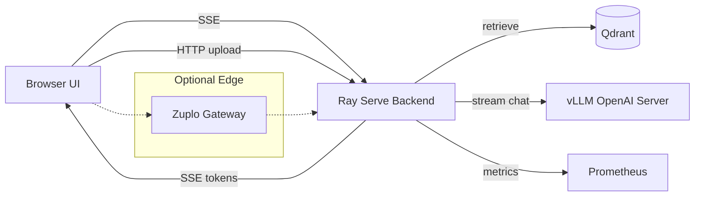

# Architecture

## Overview

- Frontend: React (Vite) chat UI with SSE streaming and metrics snapshot.
- Backend: Ray Serve deployment using Haystack for retrieval and vLLM for generation.
- Vector store: Qdrant for persistence (helm-deployed, OSS).
- LLM serving: vLLM OpenAI-compatible server for streaming tokens.
- Orchestration: KubeRay (RayService) running the backend workload.
- Packaging: Helm chart + Kustomize overlays for provider-specific diffs.

## Data flow

1. User uploads PDFs/text/URLs to `/ingest`.
2. Backend extracts text, chunks, embeds, and writes documents to the store.
3. User queries `/query` or `/query/stream`.
4. Backend retrieves top documents and calls vLLM for streaming generation.
5. SSE returns `meta`, `token`, `done`, `error` events to the UI.

## Architecture diagram

## Observability

- `/metrics` exposes Prometheus-compatible counters and latency histograms.
- `/stats` provides a lightweight UI-friendly snapshot of timings.
- Structured JSON logs via `python-json-logger`.

## SSE event contract

- `meta`: `session_id`, `request_id`, `replica_id`, `model_id`, `k` (+ documents/optional timings)
- `token`: incremental text payloads
- `done`: `session_id`, `request_id`, `replica_id`, `model_id`, `k`, `timings` (`ttft_ms`, `total_ms`),
  `token_count`, `tokens_per_sec`
- `error`: safe message + request/session identifiers

Client-side TTFT and total latency are computed from send → first token/done; server values are
included for reference.

## Deployment

- Helm chart `deploy/helm/rag-app` installs backend, frontend, Qdrant, and RayService.
- Kustomize overlays in `deploy/overlays` customize storage class per provider.
